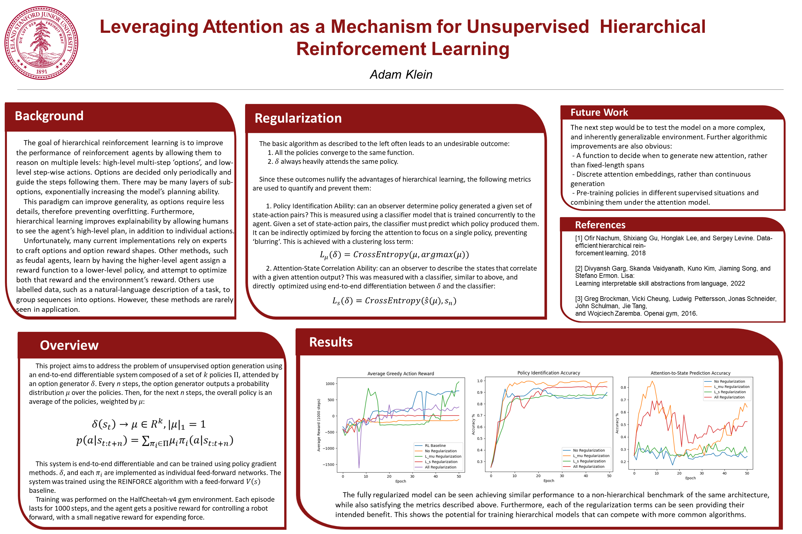

# AttenPi

### An end-to-end differentiable hierarchical reinforcement learning agent based on continuous sub-policy attention. (See attenpi-paper.pdf for more details)

 - experiments: Folder containing discarded work and expiriments.
 
 - figs: Folder containing plots of training data.
 
 - logs: Folder containing training progress plots and log files.
 
 - configs.py: Model configuration options for QuantumPolicy.

 - model_utils.py: Model subclasses and helper functions.
 
 - plot_data.py: Script to plot data from log files.
 
 - pretrain_cnn.py: Script to pretrain the CNN used for 'coinrun' environment.
 
 - quantum_policy.py: Contains the QuantumPolicy class, which implements the AttenPi algorithm.
 
 - train.py: Environment and script used to train QuantumPolicy
 
 - train_utils: General training script and helper functions.
